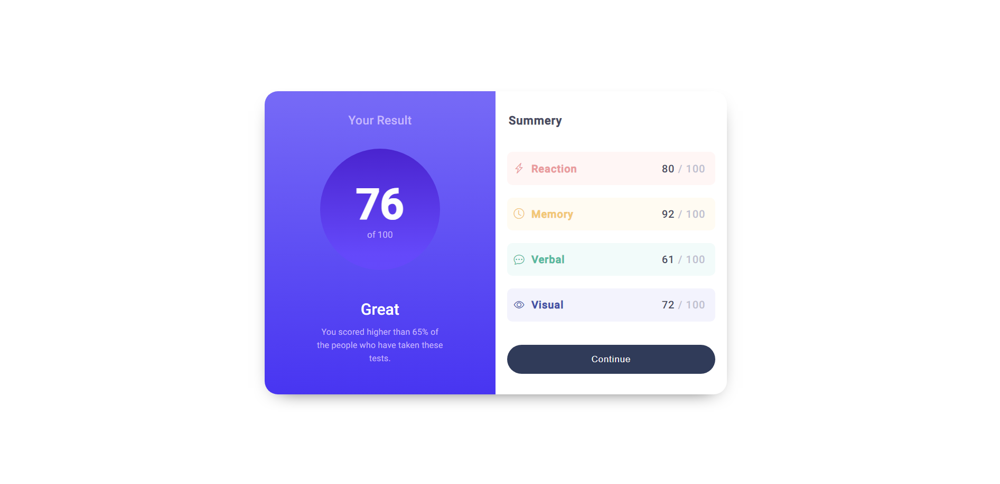
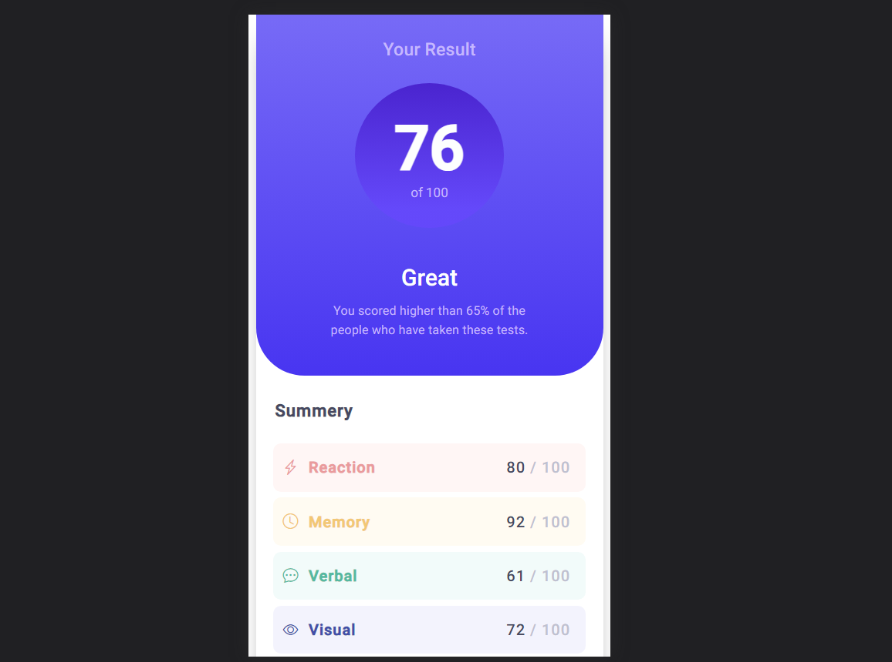
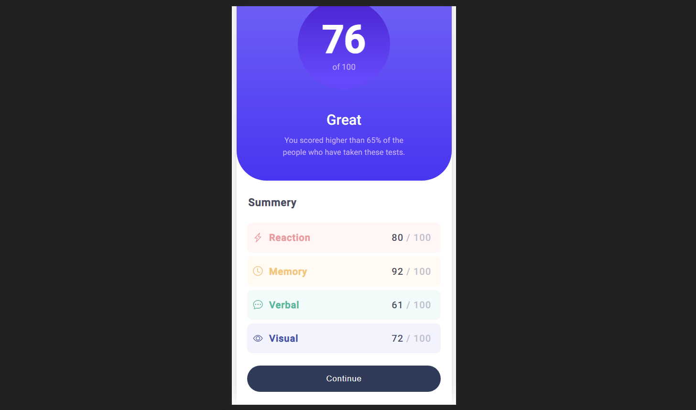

# Result summery component using HTML and CSS

<!-- Add an appropriate project title here -->

## Description

<!-- Provide a brief description of your project -->

This project is a simple web application that displays a user's test result and a summary of their scores in different categories. It demonstrates responsive design using media queries to ensure proper rendering on various screen sizes.

## Technologies Used

<!-- List the technologies and libraries used in your project -->

- HTML
- CSS
- Bootstrap Icons

## Installation

<!-- Provide instructions on how to install and run your project locally -->

1. Clone the repository:
    
    https://github.com/iamdylanmj/simple-card-1.git

2. Open the project folder:

3. Open the `index.html` file in your web browser.

## Screenshots

<!-- If possible, add screenshots of your web application in different screen sizes -->

Here are some screenshots of the web application in different screen sizes:

### Desktop View

### Mobile View-1

### Mobile View-2

## Responsive Design

<!-- Explain how you implemented responsive design in your project -->

The project utilizes CSS media queries to adjust the layout and styling based on different screen sizes. The main container, `.main-cont`, adapts its width and height to fit smaller screens, and the `.main-cont__result` section becomes scrollable to ensure all content remains accessible.

## Acknowledgements

<!-- Give credit to any resources, tutorials, or inspiration you used in your project -->

- [Bootstrap Icons](https://icons.getbootstrap.com/)

## License

<!-- Choose an appropriate license for your project (e.g., MIT, Apache, GPL) -->

This project is licensed under the [MIT License](LICENSE).
